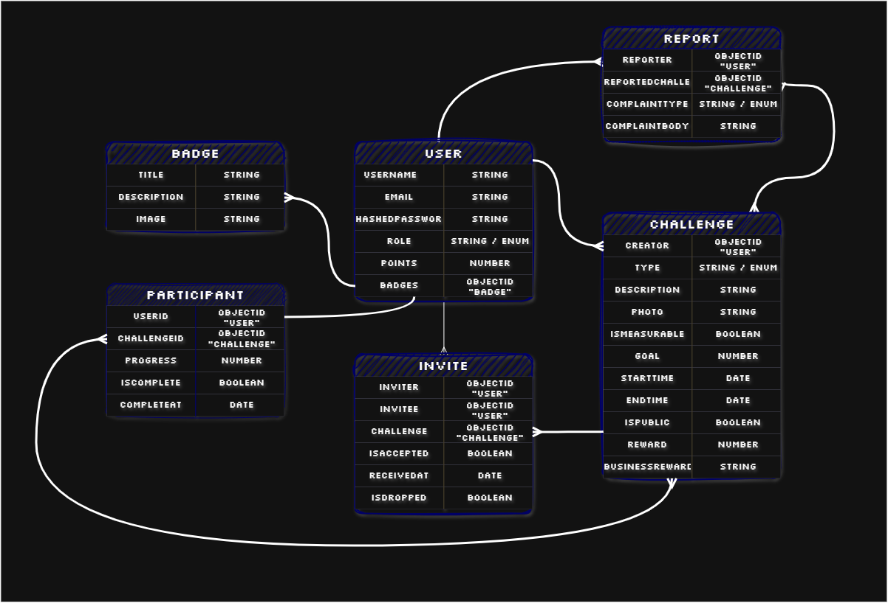

# Bahrain.Go!
Explore. Challenge. Connect.


## Backend API


## Overview
This repository contains the Node.js, Express and MongoDB backend for **Bahrain.Go!**


## Related Links
- **Backend API:** [Deployed Backend](https://bahraingo.onrender.com/)
- **Frontend Application:**  [Deployed Frontend](https://bahraingo.netlify.app/)
- **Frontend Repository:** [Frontend Github Repository](https://github.com/zahera-sh/BahrainGo-Frontend)


## Technologies Used
- Node.js
- Express
- MongoDB
- Mongoose
- JSON Web Tokens
- bcrypt
- dotenv
- Morgan
- Jest
- Supertest


## Features
- User registration
- User login and logout
- Authentication middleware
- CRUD API endpoints
- Request validation
- MongoDB relationships
- Rate Limiting
- Clear Error Handling with proper status codes
- Automated API tests
- Role-based authorization


## Project Structure
```text
BahrainGo-Backend/
├── .github/
├── assets/
├── config/
├── controllers/
├── middleware/
├── models/
├── routes/
├── tests/
├── app.js
├── README.md
└── server.js
```


### Folder Responsibilities
| Folder        | Purpose                                         |
| ------------- | ----------------------------------------------- |
| `assets`      | Images                                          |
| `config`      | Database and application configuration          |
| `controllers` | HTTP request and response handling              |
| `middleware`  | Authentication, validation and error middleware |
| `models`      | Mongoose schemas and models                     |
| `routes`      | Express route definitions                       |
| `tests`       | Automated tests                                 |
| `app.js`      | Express application configuration               |
| `server.js`   | Database connection and server startup          |


## Getting Started


### Prerequisites
Install:
- node.js
- MongoDB Atlas account


## Installation


### 1. Clone the repository
```bash
git clone https://github.com/zahera-sh/BahrainGo-Backend
cd BahrainGo-Backend
```


### 2. Install dependencies
```bash
npm install
```


### 3. Create the environment file
Create `.env` in the root directory:

```env
PORT=3000
MONGODB_URI=your-connection-string
CLIENT_URL=http://localhost:5173
JWT_SECRET=unique-password
```


### 4. Start the development server
```bash
npm run dev
```

The API should be available at:

```text
http://localhost:3000
```


## Database Models

### 👤 User

| Field | Type | Rules |
|---|---|---|
| `username` | String | Required, unique, trimmed, lowercase |
| `email` | String | Required, unique, trimmed, lowercase |
| `hashedPassword` | String | Required, hidden from JSON responses |
| `role` | String | One of `user`, `admin`, `business`; default `user` |
| `points` | Number | Default `0`, minimum `0` |
| `badges` | ObjectId[] | References `Badge` |
| `isDeleted` | Boolean | Default `false` |
| `createdAt` | Date | Automatically generated by timestamps |
| `updatedAt` | Date | Automatically generated by timestamps |


### 🚩 Report

| Field | Type | Rules |
|---|---|---|
| `reporter` | ObjectId | Required, references `User` |
| `reportedChallenge` | ObjectId | Required, references `Challenge` |
| `complaintType` | String | Required, one of the defined complaint types |
| `complaintBody` | String | Required, trimmed |
| `isSolved` | Boolean | Default `false` |
| `createdAt` | Date | Automatically generated by timestamps |
| `updatedAt` | Date | Automatically generated by timestamps |

**Complaint Types**

- `Harmful or Dangerous Content`
- `Harrassment or Hate Speech`
- `Sexual or Inappropriate Content`
- `Privacy or Personal Information`
- `Fraud or Scam`
- `Reward Not Provided`
- `Reward or Challenge Misrepresentation`
- `Violation of Terms of Service`
- `Spam or Misleading Content`
- `Other`


### 👥 Participant

| Field | Type | Rules |
|---|---|---|
| `userId` | ObjectId | Required, references `User` |
| `challengeId` | ObjectId | Required, references `Challenge` |
| `progress` | Number | Default `0`, minimum `0` |
| `isComplete` | Boolean | Default `false` |
| `completeAt` | Date | Optional |
| `logs` | Array | Contains `comment` and `createdAt` |
| `logs.comment` | String | Optional |
| `logs.createdAt` | Date | Default current date/time |
| `createdAt` | Date | Automatically generated by timestamps |
| `updatedAt` | Date | Automatically generated by timestamps |


### 📩 Invite

| Field | Type | Rules |
|---|---|---|
| `inviter` | ObjectId | Required, references `User` |
| `invitee` | ObjectId | Required, references `User` |
| `challenge` | ObjectId | Required, references `Challenge` |
| `isAccepted` | Boolean | Default `false` |
| `isRejected` | Boolean | Default `false` |
| `receivedAt` | Date | Default current date/time |
| `isDropped` | Boolean | Default `false` |
| `createdAt` | Date | Automatically generated by timestamps |
| `updatedAt` | Date | Automatically generated by timestamps |

**Index:** `challenge` + `invitee` must be unique.


### 🎯 Challenge

| Field | Type | Rules |
|---|---|---|
| `creator` | ObjectId | Required, references `User` |
| `type` | String | Required, one of `Community`, `Wellness`, `Adventure`, `Bucket List`, `Exclusive`, `Local`, `Food`, `Fitness`, `Exploration`, `Social`, `Business`, `Other` |
| `description` | String | Required, trimmed, minimum 10 characters |
| `isMeasurable` | Boolean | Default `false` |
| `goal` | Number | Default `1`, minimum `1` |
| `startTime` | Date | Optional |
| `endTime` | Date | Optional |
| `isPublic` | Boolean | Default `true` |
| `reward` | Number | Default `10`, minimum `0` |
| `businessReward` | String | Optional, trimmed |
| `isDeleted` | Boolean | Default `false` |
| `status` | String | One of `Starting Soon`, `Ended`, `Deleted`, `Completed`, `Dropped`, `Accepted`, `Rejected`, `New`; default `New` |
| `createdAt` | Date | Automatically generated by timestamps |
| `updatedAt` | Date | Automatically generated by timestamps |


### 🏅 Badge

| Field | Type | Rules |
|---|---|---|
| `title` | String | Required, unique, trimmed |
| `description` | String | Required, trimmed |
| `image` | String | Optional |
| `createdAt` | Date | Automatically generated by timestamps |
| `updatedAt` | Date | Automatically generated by timestamps |


## Entity Relationships



## API Base URL

Local development:

```text
http://localhost:3000
```

Production:

```text
https://your-deployed-api.com
```


## Endpoints

### Admin Endpoints

| Method | Endpoint | Authentication | Description |
|---|---|---|---|
| `GET` | `/users` | `verifyToken` | Get all users |
| `DELETE` | `/users/:id` | `verifyToken` | Delete a user by ID |
| `GET` | `/challenges` | `verifyToken` | Get all challenges |
| `DELETE` | `/challenges/:id` | `verifyToken` | Delete a challenge by ID |
| `GET` | `/reports` | `verifyToken` | Get all reports |


### Authentication Endpoints

| Method | Endpoint | Authentication | Description |
|---|---|---|---|
| `POST` | `/sign-up` | Public | Create a new user account |
| `POST` | `/sign-in` | Public | Sign in a user |
| `GET` | `/me` | `verifyToken` | Verify the authenticated user |


### Challenge Endpoints

| Method | Endpoint | Authentication | Description |
|---|---|---|---|
| `POST` | `/` | `verifyToken` | Create a new challenge |
| `GET` | `/` | Public | Get all public challenges |
| `GET` | `/my-challenges` | `verifyToken` | Get the authenticated user's challenges |
| `DELETE` | `/:id` | `verifyToken` | Delete a challenge by ID |
| `GET` | `/:id` | `verifyToken` | Get a challenge by ID |


### Invite Endpoints

| Method | Endpoint | Authentication | Description |
|---|---|---|---|
| `POST` | `/` | `verifyToken` | Create a challenge invite |
| `GET` | `/` | `verifyToken` | Get the authenticated user's invites |
| `PUT` | `/:id/accept` | `verifyToken` | Accept an invite |
| `PUT` | `/:id/reject` | `verifyToken` | Reject an invite |
| `PUT` | `/:id/drop` | `verifyToken` | Drop a challenge |


### Participant Endpoints

| Method | Endpoint | Authentication | Description |
|---|---|---|---|
| `GET` | `/my-participants` | `verifyToken` | Get the authenticated user's participants |
| `GET` | `/:id` | `verifyToken` | Get participants for a challenge |
| `PUT` | `/:id` | `verifyToken` | Update challenge progress |
| `POST` | `/:id` | `verifyToken` | Join a challenge |


### Report Endpoints

| Method | Endpoint | Authentication | Description |
|---|---|---|---|
| `POST` | `/` | `verifyToken` | Create a report |
| `GET` | `/` | `verifyToken` | Get reports |
| `PUT` | `/:id/solve` | `verifyToken` | Mark a report as solved |


## Status Codes
| Status | Meaning in this API                |
| -----: | ---------------------------------- |
|  `200` | Successful request                 |
|  `201` | Resource created                   |
|  `204` | Successful deletion with no body   |
|  `400` | Invalid request                    |
|  `401` | Authentication required or invalid |
|  `403` | Authenticated but not permitted    |
|  `404` | Resource not found                 |
|  `409` | Resource conflict                  |
|  `429` | Too many requests                  |
|  `500` | Unexpected server error            |


## Testing
Run tests:

```bash
npm test
```

Tests should use a dedicated test database or an in-memory database.


## Future Enhancements

1. **Customizable Public Profiles**  
  Allow users to customize and personalize their public profiles, including profile information and preferences.
2. **Full Business Role Functionality**  
  Expand the business role with features for managing business rewards, challenges, and business-related activities.
3. **Weekly System-Generated Challenges**  
  Automatically create and publish new challenges on a weekly basis to keep users engaged.
4. **Map-Based Challenge Locations**  
  Add map integration to allow users to discover and find challenges based on their location.
5. **Photos in Challenge Logs**  
  Allow participants to attach photos to their challenge progress logs.
6. **Profile Photos**  
  Allow users to upload and select a profile photo for their account.
7. **Search and Filtering**  
  Add search and filtering functionality to help users easily find challenges based on criteria such as type, location, status, and other preferences.


## Contribution
**Bahrain.Go!** is designed and developed by:

| Name           | GitHub                                          |
| -------------- | ----------------------------------------------- |
| Zahera Sh.     | [🪞✨](https://github.com/zahera-sh)           |


## Credits
Special thanks to my instructor [Mr. Omar](https://github.com/omarakamal) for his motivation speeches, constant guidance, support, and feedback throughout the project.


## License
This project was created as the third project of the General Assembly Software Engineering Bootcamp and is open source. You are welcome to view, study, use, modify, and distribute this project for personal or educational purposes only, provided that appropriate credit is given to the original authors.